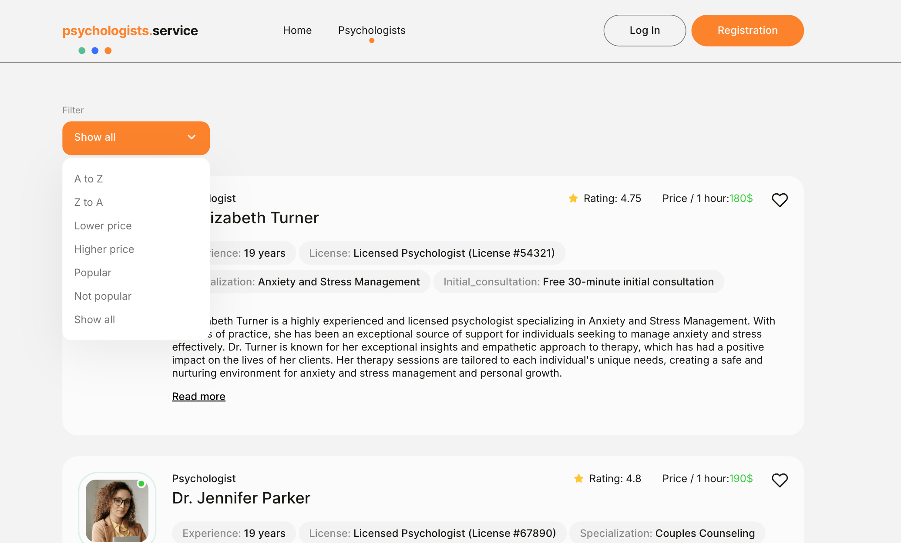
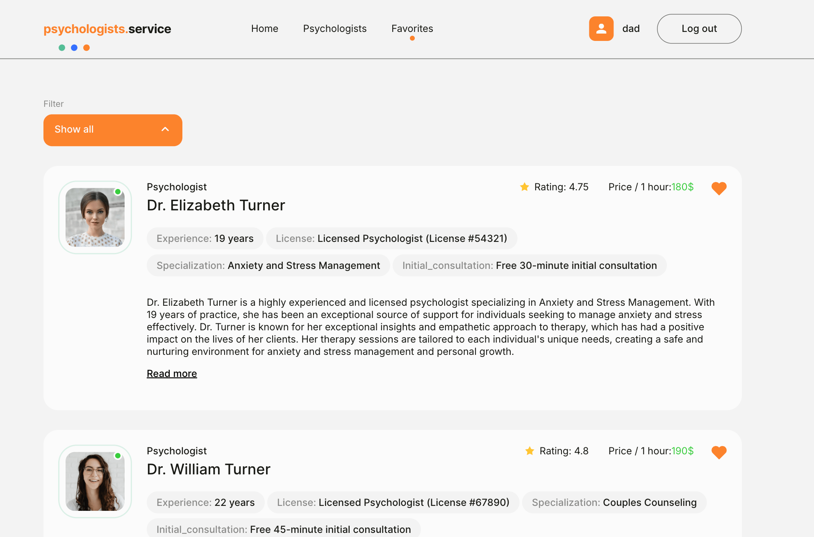
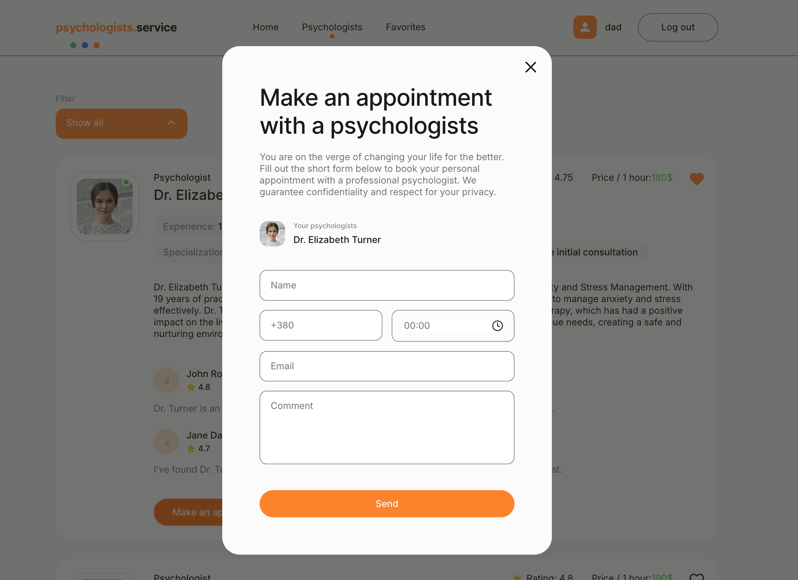

## Назва проєкту: Psychologists

🟢 [Переглянути демо](https://psychologists-eight.vercel.app/)

- 🔗 [Макет у Figma](https://www.figma.com/design/I5vjNb0NsJOpQRnRpMloSY/Psychologists.Services?node-id=0-1)
- 📄 [Технічне завдання](https://docs.google.com/document/d/1PrTxBn6HQbb0Oz17g5_zvyLGIOZg0TIP3HPaEEp6ZLs/edit?tab=t.0)

---

## Опис

**Psychologists** — це сучасний веб-застосунок для пошуку кваліфікованих психологів, створений для зручного бронювання консультацій та ведення списку улюблених спеціалістів. 

- Адаптивна верстка: mobile / tablet / desktop
- Теми: зелена, синя, помаранчева
- Авторизація через Firebase

---

## Технології

### Frontend

- React 19
- React Router v7
- React Redux + Redux Toolkit
- Formik + Yup
- React Modal / React Hot Toast / React Spinners
- clsx / modern-normalize

### Backend

- **Firebase Realtime Database** 

    - 'psychologists/' — список всіх спеціалістів

    - 'users/{userId}/favorites/' — обрані психологи

    - 'appointments/' — запис на прийом

- **Firebase Auth** – реєстрація, логін, лог аут

### Tooling

- Vite
- ESLint
- @vitejs/plugin-react-swc

---

## Функціонал

### Авторизація:
- Реєстрація / Вхід 
- Збереження сесії 
- Вихід

### Сторінка Psychologists:
- Отримання даних з Firebase
- Пагінація по 3 картки
- Сортування:
  - A to Z / Z to A
  - Ціна: ↑ / ↓
  - Рейтинг: ↑ / ↓
- Кнопка “Load More” для підвантаження

### Сторінка Favorites:
- Персональний список улюблених
- Сортування та пагінація, як на основній сторінці

### Бронювання:
- Модальне вікно для запису
- Дані запису зберігаються у (`appointments`)

---

## Встановлення
- git clone https://github.com/Lencha2005/Psychologists.git
- cd Psychologists
- npm install
- npm run dev

## Автор
Lencha2005 – https://github.com/Lencha2005GitHub
